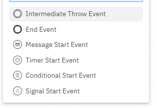
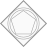
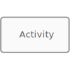
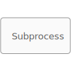
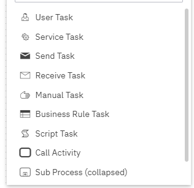

BPMN 2.0
=========

# Pools and Lanes 

**Um so die verschiedenen Prozessteilnehmer abzubilden, werden Pools und Lanes genutzt**

**Pools**

  Pools repräsentieren einen der Lanes übergeordneten Prozessteilnehmer

**Lanes**

  Lanes können Organisationseinheiten oder Rollen sein. Sie werden in Pools gruppiert.

# Ereignisse

**Ereignisse werden genutzt um den Start, das Ende oder den Ablauf eines Prozesses zu kennzeichnen.**

> Eingetretene Ereignisse sind Zustände, die durch einen externen Auslöser erzeugt werden

> Ausgelöste Ereignisse sind Zustände, die vom Prozess selbst erzeugt wurden

**Regel:** Es müssen immer alle aktiven Pfade je Prozessebene bendet werden.

**Start Ereignisse**

 Das Startereignis löst den Sequenzfluss eines Prozesses aus.

**Zwischenergenis Ereignisse**

 Ein Zwischenereignis unterbricht den Sequenzfluss temporär.

**End Ereignisse**

 Endereignisse beenden den Sequenzfluss.

**Ereignis-definition**

Es kann jedes Erreignis mit einem Symbol / definition ergänzt werden. 

# Gateway 

**Gateway's werden benötigt um Aufspaltungen und Zusammenführungen eines Sequensfluss darzustellen.**

**exklusive Gateways**

 wenn genau eine Bedingung eintreffen darf **(„entweder/oder“)**

**Zusammenführung:** muss genau **ein** eingehender Prozesspfad erfüllt sein.

--------

**Paralleles Gateway**

 Es müssen alle ausgehenden Prozesspfade verfolgt werden **(„und“)**

**Zusammenführung:** alle eingehenden Pfade erfüllt sind, darf der Prozessfluss fortgesetzt werden.

---------

**Inklusives Gateway**

 Wenn einem oder mehreren Prozesspfade gefolgt werden kann **(„und/oder“)**

**Zusammenführung:** muss auf alle zuvor ausgelösten Pfade gewartet werden

-----------

**Ereignis-basiertes Gateway**

 Bei ereignis-basierten Gateways wird derjenige Sequenzfluss verflogt, dessen Ereignis zeitlich als **erstes eintritt**.

# Aktivitäten 

**Abbildung von einzelnen Prozessschritten**

***Aktivität***

 Stellt einen Arbeitsschritt dar und wird aktiv formuliert.

***Teilprozess***

 Stellt eine Prozess mit mehreren unter aktivitäten dar.

***Task-definition***

 Aktivitäten können mit einem Symbol / definition ergänzt werden.

# Sequenzfluss 
Fluss Lienien / Lienien zwischen erregnissen. 
Reienfolge wird definiert

*** Link-Ereignis***

Weiterleitung 

> Symbole = dicker Pfeil
